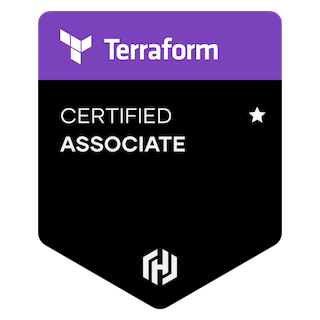

# HashiCorp Terraform Associate (003)

- This will help you for quick revision before exam.
- If you are studying for HashiCorp Terraform Associate (003) certifications or you already have them but want to have digital notes of what you studied, here it is and you can come back as many times as you need.
- [Official Study guid](https://www.hashicorp.com/certification/terraform-associate)

Each Section contains a number of units. **Below Table Link** containing information about each sections in detail.

## Table of contents

- [Introduction to Infrastructure as Code (IAC)](./introduction/Infrastructure-as-code.md)
  - Problem with Manual Configuration, Infrastructure as Code (IaC), Advantages of IaC patterns, What is Infrastructure Lifecycle?, Idempotent vs Non-Idempotent, Provisioning vs Deployment vs Orchestration, Configuration Drift, Mutable vs Immutable Infrastructure, What is GitOps?, Immutable Infrastructure Guarantee

## Visitors Count

