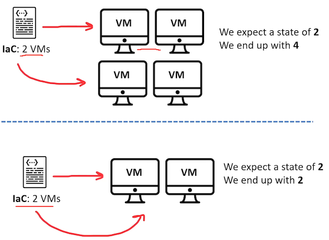

# Introduction to Infrastructure as Code (IAC)

- [Introduction to Infrastructure as Code (IAC)](#introduction-to-infrastructure-as-code-iac)
  - [The Problem with Manual Configuration](#the-problem-with-manual-configuration)
  - [Infrastructure as Code (IaC)](#infrastructure-as-code-iac)
    - [Why Multiple IAC Tools?](#why-multiple-iac-tools)
    - [Categories of IAC Tasks](#categories-of-iac-tasks)
    - [Different IAC Tools and Their Roles](#different-iac-tools-and-their-roles)
    - [Key Differences Between IAC Tools](#key-differences-between-iac-tools)
    - [Choosing the Right IAC Tool](#choosing-the-right-iac-tool)
  - [Advantages of IaC patterns](#advantages-of-iac-patterns)
  - [What is Infrastructure Lifecycle?](#what-is-infrastructure-lifecycle)
    - [Infrastructure Lifecycle Advantages](#infrastructure-lifecycle-advantages)
  - [Idempotent vs Non-Idempotent](#idempotent-vs-non-idempotent)
  - [Provisioning vs Deployment vs Orchestration](#provisioning-vs-deployment-vs-orchestration)
  - [Configuration Drift](#configuration-drift)
    - [How to detect configuration drift?](#how-to-detect-configuration-drift)
    - [How to correct configuration drift?](#how-to-correct-configuration-drift)
    - [How to prevent configuration drift?](#how-to-prevent-configuration-drift)
  - [Mutable vs Immutable Infrastructure](#mutable-vs-immutable-infrastructure)
  - [What is GitOps?](#what-is-gitops)
  - [Immutable Infrastructure Guarantee](#immutable-infrastructure-guarantee)
  - [Conclusion](#conclusion)

## The Problem with Manual Configuration

Manually configuring your cloud infrastructure allows you easily start using new service offerings
to quickly prototype architectures however it comes with many downsides:

- Its easy to mis-configure a service though human error
- Its hard to manage the expected state of configuration for compliance
- Its hard to transfer configuration knowledge to other team members

## Infrastructure as Code (IaC)

- You write a configuration script to automate **creating, updating or destroying** cloud infrastructure.
- IaC is a **blueprint** of your infrastructure.
- IaC allows you to easily **share, version or inventory** your cloud infrastructure.
- Infrastructure as Code (IAC) automates the process of setting up and managing infrastructure.
- It replaces manual tasks performed by system administrators, reducing human errors and resource costs.
- IAC tools automate tasks in three main categories: provisioning, configuring, and deploying infrastructure.
- The process involves initial setup and subsequent maintenance phases.

### Why Multiple IAC Tools?

- No single IAC tool can handle all tasks from start to finish.
- Each tool specializes in specific areas within the three main categories.
- Often, a combination of two or more tools is used to automate the entire process.

### Categories of IAC Tasks

1. **Provisioning Infrastructure**
   - Creating new servers, configuring networking, and setting up load balancers.

2. **Configuring Provisioned Infrastructure**
   - Installing applications and software on servers.
   - Managing and maintaining those applications.

3. **Deploying Applications**
   - The primary goal is to run your application on the provisioned and configured infrastructure.

### Different IAC Tools and Their Roles

1. **TerraForm**
   - Used for provisioning and managing infrastructure.
   - Can also handle initial installation and configuration of software.
   - Not suitable for software maintenance.

2. **Ansible, Chef, Puppet**
   - Used for configuring and deploying applications.
   - Suitable for managing both infrastructure and software.
   - Can be used for provisioning initial server setup.

### Key Differences Between IAC Tools

- Declarative vs. Procedural Approach:
  - Declarative: Specify the desired end result.
  - Procedural: Define step-by-step execution.

- Mutable vs. Immutable Infrastructure:
  - Mutable: Modify existing infrastructure.
  - Immutable: Always create new instances, replacing the old.

- Agent vs. Agent-less Tools:
  - Some IAC tools require agents on target systems, while others are agent-less.

### Choosing the Right IAC Tool

- The choice depends on preferences and specific project requirements.
- Consider factors like declarative vs. procedural, mutable vs. immutable, and the need for agents or a master.

## Advantages of IaC patterns

- Build & manage your infra in safe, consistent & repeatable ways
- Share & reuse your configurations more easily
- Manage infra on multiple cloud platforms
- Track resource changes
- Use version control (Git, GitHub, etc..) to collaborate with team members

## What is Infrastructure Lifecycle?

- a number of clearly defined and distinct work phases which are used by DevOps Engineers to **plan, design, build, test, deliver, maintain and retire** cloud infrastructure.

- What is Day 0, Day 1 and Day 2?
- Day 0-2 is a simplified way to describe phases of an infrastructure lifecycle
  - Day 0 — Plan and Design
  - Day 1 — Develop and Iterate
  - Day 2 — Go live and maintain

### Infrastructure Lifecycle Advantages

How does laC enhance the Infrastructure Lifecycle?

- **Reliability:** IaC makes changes idempotent, consistent, repeatable, and predictable.
  - Idempotent: No matter how many times you run laC, you will always end up with the same state that is expected
- **Manageability:**
  - enable mutation via code
  - revised, with minimal changes
- **Sensibility:**
  - avoid financial and reputational losses to even loss of life when
  - considering government and military dependencies on infrastructure.

## Idempotent vs Non-Idempotent

| **Idempotent**                                                                                                         | **Non-Idempotent**                                                                        |
| --------------------------------------------------------------------------------------------------------------------- | ----------------------------------------------------------------------------------------- |
| When I deploy my laC config file it will provision and launch 2 virtual machines                                       | When I deploy my IaC config file it will provision and launch 2 virtual machines          |
| When I update my laC and deploy again, it will update the VMs if changed by modifying or deleting and creating new VMs | When I update my laC and deploy again, I will end up with 2 new VMs with a total of 4 VMs |

## Provisioning vs Deployment vs Orchestration

- **Provisioning**
  - To prepare a server with systems, data and software, and make it ready for network operation.
  - Using Configuration Management tools like Puppet, Ansible, Chef, Bash scripts, PowerShell or Cloud-Init you can provision a server.
  - **When you launch a cloud service and configure it you are “provisioning”**
- **Deployment**
  - Deployment is the act of delivering a version of your application to run a provisioned server.
  - Deployment could be performed via AWS CodePipeline, Harness, Jenkins, Github Actions, CircleCl
- **Orchestration**
  - Orchestration is the act of coordinating multiple systems or services.
  - Orchestration is a common term when working with microservices, Containers and Kubernetes.
  - Orchestration could be Kubernetes, Salt, Fabric

## Configuration Drift

- Configuration Drift is when provisioned infrastructure has an unexpected configuration change due to:
  - team members manually adjusting configuration options
  - malicious actors
  - side affects from APIs, SDK or CLls.
- Configuration Drift going unnoticed could be loss or breach of cloud services and residing data or result in interruption of services or unexpected downtime.
- eg, a junior developer turns on Delete on Termination for the production database.

### How to detect configuration drift?

- A compliance tool that can detect misconfiguration eg. AWS Config, Azure Policies, *GCP Security Health Analytics
- Built-in support for drift detection eg. AWS CloudFormation Drift Detection
- Storing the expected state eg. Terraform state files

### How to correct configuration drift?

- A compliance tool that can remediate (correct) misconfiguration e.g. AWS Config
- Terraform refresh and plan commands
- Manually correcting the configuration (not recommended)
- Tearing down and setting up the infrastructure again

### How to prevent configuration drift?

- Immutable infrastructure, always create and destroy, never reuse, Blue, Green deployment strategy.
- Servers are never modified after they are deployed
- Baking AMI images or containers via AWS Image Builder or HashiCorp Packer, or a build server eg. GCP Cloud Run
- Using GitOps to version control our IaC, and peer review every single via Pull Requests change to infrastructure

## Mutable vs Immutable Infrastructure

| **Mutable**                                                                                                                                                             | **Immutable**                                                                                                                                             |
| ----------------------------------------------------------------------------------------------------------------------------------------------------------------------- | --------------------------------------------------------------------------------------------------------------------------------------------------------- |
| A Virtual Machine (VM) is deployed and then a Configuration Management tool like Ansible, Puppet, Chef, Salt or Cloud-Init is used to configure the state of the server | A VM is launched and provisioned, and then and it is turned into a Virtual Image, stored in image repository, that image is used to deployed VM instances |
| Develop 👉 Deploy 👉 Configure                                                                                                                                            | Develop 👉 Configure 👉 Deploy                                                                                                                              |

## What is GitOps?

- **GitOps** is when you take Infrastructure as Code (IaC) and you use a git repository to **introduce a formal process to review and accept changes to infrastructure code**, once that code is accepted, it automatically triggers a deploy

## Immutable Infrastructure Guarantee

Terraform encourages your towards an Immutable Infrastructure architect so you get the following guarantees.

- **Cloud Resource Failure** — What if an EC2 instance fails a status check?
- **Application Failure** — What if your post installation script fails due to change in package?
- **Time to Deploy** - What if I need to deploy in a hurray?
- **Worst Case Scenario**
  - Accidental Deletion
  - Compromised by malicious attackers
  - Need to Change Regions (region outage)

## Conclusion

- Infrastructure as Code (IAC) automates infrastructure setup and management.
- Multiple IAC tools exist due to their specialization in different areas.
- TerraForm is a popular tool for provisioning and managing infrastructure.
- Understanding the distinctions between IAC tools helps select the right tool for the job.
